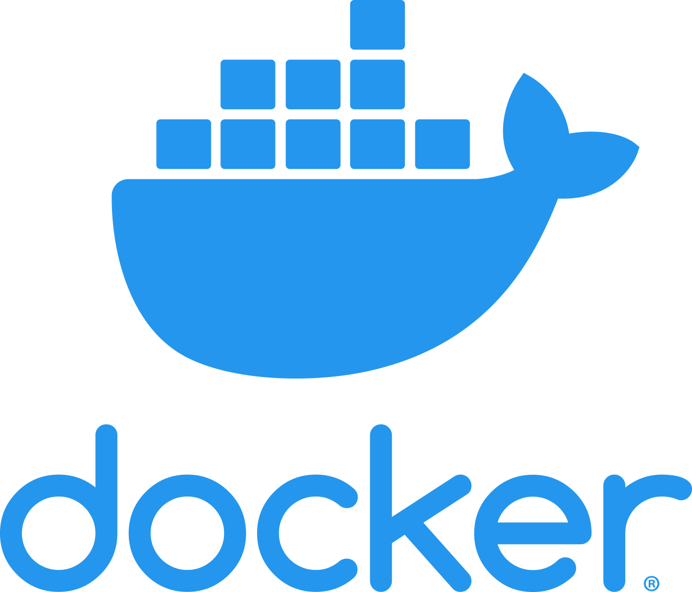

# todoist-project-allocation 
Little Todoist Bot written in Python.

## Why?!
I wanted a feature that would allow me to give a task to multiple users in a shared project, who could all perform these tasks individually.

The bot automatically adds each user as a sub-task to each task every 30 seconds, which are assigned to the user. These sub-tasks can now be processed individually by the user.
If all users have checked the task, it can be checked completely

## Docker
**Build:**
```bash
$ docker build . -t darmiel/todoist-project-allocation:latest
```

**Run:**
```bash
$ docker run -it --rm darmiel/todoist-project-allocation:latest
```
*(or if you need to specify another config file)*
```bash
$ docker run -it --rm -v ${PWD}/config:/usr/app/src/config todoist-project-allocation:latest
```

## Preview
Let's say you have the project "Test" with some Tasks:


This bot will now automatically add all users to this task:


Even with a filter for sections
